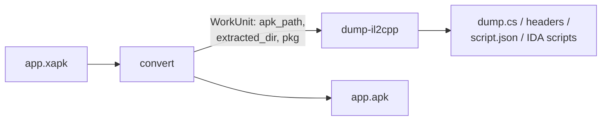

# `dumpa` — Architecture

Unity/Android reverse-engineering toolkit. Multi-command CLI that wraps external
tooling (apktool, zipalign, apksigner, aapt, Il2CppDumper/Inspector) behind a small,
dependency-light core. The current `xapktoapk.py` pipeline becomes the `convert`
command; new utilities are added as sibling commands.

> Status: design spec. Interface signatures below are contracts, not implementations.
> Implementation follows via `/sc:implement`.

## 1. Pinned decisions (from brainstorm)

| Area | Decision |
|---|---|
| Identity | Unity/Android RE toolkit (multi-command) |
| Deps | Curated Python deps allowed |
| il2cpp method | Wrap external tools via subprocess |
| il2cpp tool | Support both Il2CppDumper + Il2CppInspector, picked at runtime |
| CLI | Typer |
| Config | TOML file + environment-variable override |
| Back-compat | Clean break — no `xapktoapk` shim |
| Name | `dumpa` (package `dumpa`, command `dumpa`) |
| Min Python | 3.14+ (stdlib `tomllib`, modern syntax, no backports) |

## 2. Layering & dependency rule

```
┌────────────────────────────────────────────────────────┐
│ cli (Typer)            __main__.py · cli.py              │  presentation
├────────────────────────────────────────────────────────┤
│ commands               convert · dump_il2cpp · doctor    │  use-cases
├────────────────────────────────────────────────────────┤
│ tools (adapters)       apktool · apksigner · zipalign ·  │  external-tool wrappers
│                        aapt · il2cpp engines             │
├────────────────────────────────────────────────────────┤
│ core                   process · tools(registry) ·       │  reusable infra
│                        archive · fs · errors · logging · │
│                        artifact · config                 │
└────────────────────────────────────────────────────────┘
```

**Dependency rule:** arrows point down only.
- `core` imports nothing above it and is **Typer-free** (callable as a library).
- `tools/` adapters depend only on `core`.
- `commands/` orchestrate `tools/` + `core`; they hold the pipelines.
- `cli` is a thin Typer shell that discovers and mounts commands. No business logic.

This keeps every capability scriptable without the CLI, and lets `doctor` introspect
tool requirements without importing Typer.

## 3. Package layout

```
src/dumpa/
  __init__.py
  __main__.py              # python -m dumpa  → cli.app()
  cli.py                   # Typer root app; mounts command sub-apps from registry
  core/
    process.py             # run() — bounded subprocess (migrated verbatim)
    errors.py              # exception hierarchy (migrated + extended)
    archive.py             # safe zip extract + size/path limits
    fs.py                  # tmp dirs, link-or-copy, recreate, cleanup
    logging.py             # configure_logging, redaction helpers
    tools.py               # ToolSpec · ExternalTool · ToolRegistry
    artifact.py            # WorkUnit
    config.py              # Config load/merge (defaults < TOML < env)
  tools/
    apktool.py             # decode / build
    zipalign.py
    apksigner.py
    aapt.py                # badging parse
    il2cpp/
      __init__.py          # Il2CppEngine protocol + discovery + factory
      dumper.py            # Il2CppDumperEngine
      inspector.py         # Il2CppInspectorEngine
  commands/
    __init__.py            # COMMANDS registry
    base.py                # Command protocol
    convert.py             # thin entry: argv glue, cProfile wrapper, run_convert
    dump_il2cpp.py
    doctor.py
  convert/                 # xapk → apk pipeline (split out of commands/convert.py)
    models.py              # constants + ApkPart / StepFailure / ApktoolConfig
    apktool_config.py      # apktool.yml doNotCompress parse/merge
    classify.py            # split-type classification
    merge.py               # arch/dpi/locale/assetpack merge + dpi prioritization
    manifest.py            # signature/dummy strip + manifest rewrite
    build.py               # unpack / pack / zipalign / sign
    validate.py            # post-build integrity report
    pipeline.py            # phase_* funcs + convert_xapk (owns the registry)
  signing.py               # SignConfig + preflight (consumes config, used by convert)
docs/architecture.md
pyproject.toml             # requires-python>=3.14; [project.scripts] dumpa=dumpa.cli:app
```

## 4. Core module contracts

### 4.1 `core/errors.py`

Migrated hierarchy, extended for tool resolution and config.

```python
class DumpaError(RuntimeError): ...           # was XapkToApkError; base
class ToolExecutionError(DumpaError): ...      # external command failed
class ToolTimeoutError(ToolExecutionError): ...
class ToolNotFoundError(DumpaError): ...        # NEW — required binary missing/old
class UnsafeArchiveError(DumpaError): ...
class ManifestError(DumpaError): ...
class ConfigError(DumpaError): ...              # NEW — malformed TOML / bad values
```

Each maps to a process exit code (§9).

### 4.2 `core/process.py`

`run()` migrated **unchanged** in semantics (bounded runtime, bounded output
retention, redaction, timeout → `ToolTimeoutError`, non-zero → `ToolExecutionError`).

```python
def run(cmd: list[str], cwd: Path | None = None, fail_msg: str | None = None,
        extra_env: dict[str, str] | None = None, timeout: int | None = None,
        capture_stdout: bool = False, capture_stderr: bool = False,
        ) -> subprocess.CompletedProcess[str]: ...
```

This stays the single chokepoint for subprocess execution. Adapters never call
`subprocess` directly.

### 4.3 `core/tools.py` — tool registry (load-bearing)

Generalizes today's scattered `resolve_executable(...) is None → raise` checks and
`_verify_required_tools` into one declarative registry.

```python
@dataclass(frozen=True)
class ToolSpec:
    name: str                              # logical name, e.g. "apktool"
    executables: tuple[str, ...]           # PATH candidates, in priority order
    version_argv: tuple[str, ...] | None   # e.g. ("--version",); None = skip probe
    version_parse: Callable[[str], str | None] | None
    min_version: str | None
    install_hint: str                      # shown by doctor on failure

@dataclass(frozen=True)
class ResolvedTool:
    spec: ToolSpec
    argv_prefix: tuple[str, ...]           # from resolve_executable (incl .bat fallback)
    version: str | None

class ToolRegistry:
    def register(self, spec: ToolSpec) -> None: ...
    def resolve(self, name: str) -> ResolvedTool: ...     # raises ToolNotFoundError
    def require(self, *names: str) -> None: ...           # batch preflight
    def probe_all(self) -> list[ProbeResult]: ...         # for doctor; never raises
```

- Path resolution reuses the cached `resolve_executable` (PATH + `.bat`) logic.
- Config `[tools]` path overrides are injected at registry construction (§7).
- One global registry is built at startup from every command's declared
  `required_tools` (§6), so `doctor` and preflight share one source of truth.

### 4.4 `core/artifact.py` — `WorkUnit`

The object commands consume and produce; enables chaining without re-extraction.

```python
@dataclass
class WorkUnit:
    source: Path                  # original input (.xapk or .apk)
    apk_path: Path | None         # built/normal apk once available
    extracted_dir: Path | None    # raw unzip dir (lib/, assets/, ...)
    package_name: str | None
    tmp: Path                     # owning tmp workspace (lifecycle below)
    meta: dict[str, Any]          # split info, arch list, engine outputs, ...

    def ensure_extracted(self, registry: ToolRegistry) -> Path: ...
        # lazily raw-unzip apk_path → extracted_dir (core.archive, NOT apktool)
```

Lifecycle: created against a `working_tmp_dir` context; the tmp tree is the unit's
sandbox and is cleaned on context exit. `convert` produces a `WorkUnit` with
`apk_path` set; `dump-il2cpp` accepts one (or builds a minimal one from a raw apk).

### 4.5 `core/archive.py`, `core/fs.py`, `core/logging.py`

Direct migrations of existing helpers:
- `archive.py`: `safe_extract_zip`, `_safe_zip_member_path`, zip size/count limits.
- `fs.py`: `working_tmp_dir`, `create_or_recreate_dir`, `link_or_copy`,
  `delete_file_if_exists`, Windows hide.
- `logging.py`: `configure_logging`, `_sanitize_log_value`, `_format_command`.

### 4.6 `core/config.py` — layered config

```python
@dataclass(frozen=True)
class Config:
    signing: SigningConfig | None
    tools: dict[str, Path]        # logical name → explicit executable path
    il2cpp: Il2CppConfig
    convert: ConvertDefaults

def load_config(explicit_path: Path | None = None) -> Config: ...
```

Merge order (lowest → highest precedence):
1. **defaults** (code constants — heap size, timeouts, default engine).
2. **TOML** — first found of: `--config PATH`, `./dumpa.toml`,
   `$XDG_CONFIG_HOME/dumpa/config.toml`. Parsed with stdlib `tomllib`.
3. **environment** — `DUMPA_*` vars override matching keys (CI / secrets).

Malformed TOML or out-of-range values → `ConfigError`.

## 5. External-tool adapters (`tools/`)

Each adapter is a thin, typed function set over `core.run` + the resolved tool. They
own tool-specific argv quirks (the `--` sentinel, retry-with-`--keep-broken-res`,
`_JAVA_OPTIONS` heap lift) so commands stay declarative.

```python
# tools/apktool.py
def decode(tool: ResolvedTool, apk: Path, out: Path, split_type: str) -> None: ...
def build(tool: ResolvedTool, apk_dir: Path) -> Path: ...     # returns built apk

# tools/zipalign.py
def align(tool: ResolvedTool, apk: Path) -> None: ...          # in-place -p -f 4

# tools/apksigner.py
def sign(tool: ResolvedTool, apk: Path, sign: SignConfig) -> None: ...
def verify(tool: ResolvedTool, apk: Path) -> bool: ...

# tools/aapt.py
def badging(tool: ResolvedTool, apk: Path) -> Badging: ...     # pkg, versionName, ...
```

### 5.1 il2cpp engines (`tools/il2cpp/`)

The dual-tool decision is isolated behind one protocol; the rest of the codebase is
engine-agnostic.

```python
class Il2CppEngine(Protocol):
    name: str
    required_tools: tuple[str, ...]        # e.g. ("dotnet",) + bundled jar/dll

    def dump(self, inputs: Il2CppInputs, out_dir: Path,
             registry: ToolRegistry) -> Il2CppResult: ...

@dataclass(frozen=True)
class Il2CppInputs:
    binary: Path        # lib/<arch>/libil2cpp.so (or per-platform equivalent)
    metadata: Path      # assets/bin/Data/Managed/Metadata/global-metadata.dat
    arch: str

@dataclass(frozen=True)
class Il2CppResult:
    engine: str
    out_dir: Path
    artifacts: dict[str, Path]   # {"dump_cs": ..., "headers": ..., "script_json": ...}
```

Shared discovery (engine-independent), in `tools/il2cpp/__init__.py`:

```python
def find_il2cpp_inputs(extracted_dir: Path, *, arch: str | None = None
                       ) -> list[Il2CppInputs]: ...
    # globs lib/*/libil2cpp.so + locates global-metadata.dat; one entry per arch.

def get_engine(name: str) -> Il2CppEngine: ...   # "dumper" | "inspector"
```

- `Il2CppDumperEngine` → invokes Il2CppDumper, collects `dump.cs` + headers + `script.json`.
- `Il2CppInspectorEngine` → invokes Il2CppInspector CLI, can emit C#/JSON/IDA/Ghidra.
- Engine selection: `--engine` flag → falls back to `config.il2cpp.default_engine`.

## 6. Commands (`commands/`)

```python
# commands/base.py
class Command(Protocol):
    name: str                          # subcommand name, e.g. "convert"
    required_tools: tuple[str, ...]    # feeds the global ToolRegistry + doctor
    def build(self) -> typer.Typer: ...  # returns the Typer sub-app to mount
```

`commands/__init__.py` exposes `COMMANDS: list[Command]`. Adding a feature = drop a
module in `commands/` and append it to this list — `cli.py` mounts it and `doctor`
learns its tool needs automatically (open/closed; no central edits).

### 6.1 `convert` — the migrated pipeline

Direct re-home of existing `phase_*` functions; behavior unchanged. Sequence:

```
extract_xapk → classify_splits → unpack_splits → merge_splits
            → finalize_main_apk → build_and_sign → report
```

| Function | Home |
|---|---|
| `phase_extract_xapk` | `convert/pipeline.py` (uses `core.archive`) |
| `phase_classify_splits`, `determine_split_type_*` | `convert/pipeline.py` + `convert/classify.py` |
| `phase_unpack_splits`, `unpack_apk` | `convert/pipeline.py` + `convert/build.py` → `tools/apktool.decode` |
| `phase_merge_splits`, `merge_apk_*` | `convert/pipeline.py` + `convert/merge.py` |
| `phase_finalize_main_apk`, `update_main_manifest_file`, `strip_apktool_dummies` | `convert/pipeline.py` + `convert/manifest.py` |
| `build_single_apk`, `pack_apk`, `zipalign_apk`, `sign_apk` | `convert/build.py` → `tools/apktool.build` + `tools/zipalign.align` + `tools/apksigner` |
| `preflight_keystore` | `signing.py` + `tools/apksigner` |
| `report_output_apk`, `verify_*`, `_parse_aapt_badging` | `convert/validate.py` → `tools/aapt` |

`required_tools = ("apktool", "zipalign", "apksigner", "aapt")`.
Output: a `WorkUnit` with `apk_path` set.

### 6.2 `dump-il2cpp`

```
resolve input (WorkUnit | apk path)
  → ensure_extracted (raw unzip, not apktool)
  → find_il2cpp_inputs (per arch; --arch to pin)
  → get_engine(--engine | config default)
  → engine.dump(inputs, out_dir, registry)
  → report artifacts
```

`required_tools` = engine-dependent (`dotnet` + the selected tool). Resolved against
the registry at run start so a missing .NET surfaces as `ToolNotFoundError` with an
install hint, not a mid-run crash.

### 6.3 `doctor`

No input. Calls `registry.probe_all()` and prints a table: tool · found? · version ·
meets-min? · install hint. Exit 0 only if every registered tool resolves. This is the
generalization of `_verify_required_tools`, now covering the whole toolset.

## 7. Configuration schema (`dumpa.toml`)

```toml
[signing]                 # env override: DUMPA_KEYSTORE_FILE, etc.
keystore_file    = "~/keys/release.jks"
key_alias        = "release"
min_sdk_version  = 21
# passwords NOT here — env-only: DUMPA_KEYSTORE_PASSWORD, DUMPA_KEY_PASSWORD

[tools]                   # explicit paths; override PATH resolution
apktool   = "/opt/apktool/apktool"
dotnet    = "/usr/bin/dotnet"

[il2cpp]
default_engine = "inspector"        # "dumper" | "inspector"
dumper_path    = "/opt/Il2CppDumper/Il2CppDumper.dll"
inspector_path = "/opt/Il2CppInspector/Il2CppInspector"

[convert]
jvm_heap    = "2048m"
keep_broken = true                  # apktool retry behavior
```

Secret handling preserved from today: passwords are env-only and passed to apksigner
via its `env:` form, never on the command line and never in the TOML file.

## 8. Data flow

### 8.1 Convert (then optional dump) — chaining



`dumpa convert app.xapk --then dump-il2cpp` reuses the in-memory `WorkUnit` — no
second extraction. Run separately, `dump-il2cpp app.apk` builds a minimal `WorkUnit`
and raw-unzips on demand.

### 8.2 dump-il2cpp sequence

```mermaid
sequenceDiagram
  participant CLI
  participant Cmd as dump_il2cpp
  participant Reg as ToolRegistry
  participant Disc as find_il2cpp_inputs
  participant Eng as Il2CppEngine
  CLI->>Cmd: dump-il2cpp(apk, --engine, --arch)
  Cmd->>Reg: require("dotnet", engine.required_tools)
  Reg-->>Cmd: ResolvedTool[]  (or ToolNotFoundError)
  Cmd->>Cmd: ensure_extracted (core.archive)
  Cmd->>Disc: find_il2cpp_inputs(extracted, arch)
  Disc-->>Cmd: Il2CppInputs[]
  Cmd->>Eng: dump(inputs, out_dir, registry)
  Eng->>Reg: resolve(tool); core.run(...)
  Eng-->>Cmd: Il2CppResult(artifacts)
  Cmd-->>CLI: report
```

## 9. Error → exit-code contract

| Exception | Exit | Meaning |
|---|---|---|
| (success) | 0 | |
| `ToolNotFoundError` | 3 | required external tool missing/old → run `doctor` |
| `ToolTimeoutError` | 4 | external command exceeded timeout |
| `ToolExecutionError` | 5 | external command failed (rc≠0) |
| `UnsafeArchiveError` | 6 | zip-slip / size-bomb guard tripped |
| `ManifestError` | 7 | xapk/apk manifest parse failure |
| `ConfigError` | 8 | malformed config / bad values |
| `DumpaError` (other) | 1 | generic toolkit failure |
| unexpected `Exception` | 2 | bug; full traceback at `--debug` |

`commands/base.py:run_command` owns the single try/except that maps these; the
non-CLI layers raise `DumpaError` subclasses, never `sys.exit`.

## 10. Migration order (low-risk, incremental)

1. Create `src/dumpa/` package + `pyproject` (`requires-python>=3.14`, Typer dep,
   `[project.scripts] dumpa=dumpa.cli:app`). Move `xapktoapk.py` in wholesale, get
   `dumpa convert` working as a single mega-module. Verify conversion unchanged.
2. Extract `core/` (process, errors, archive, fs, logging) — pure cut/paste.
3. Build `ToolRegistry` + `doctor`; migrate `_verify_required_tools` into it.
4. Split `tools/` adapters (apktool, zipalign, apksigner, aapt) out of convert.
5. Introduce `core/config.py` (TOML+env); move signing config onto it.
6. Add `core/artifact.py` `WorkUnit`; refactor convert to produce one.
7. Add `tools/il2cpp/` engines + `commands/dump_il2cpp.py` on the `WorkUnit`.

Each step ends green (convert still converts) before the next begins.

## 11. Open items deferred to implementation

- Per-arch default for il2cpp when an apk ships multiple ABIs (pick `arm64-v8a`, or
  dump all?). Proposed default: dump `arm64-v8a` if present, else first found; `--arch all` to override.
- Whether Il2Cpp engines are bundled (vendored jar/dll) or expected on disk via
  `[il2cpp]` paths. Spec assumes on-disk + config paths; revisit if vendoring is wanted.
- `--then <cmd>` chaining syntax vs separate invocations — both supported; confirm the
  flag ergonomics during CLI implementation.
